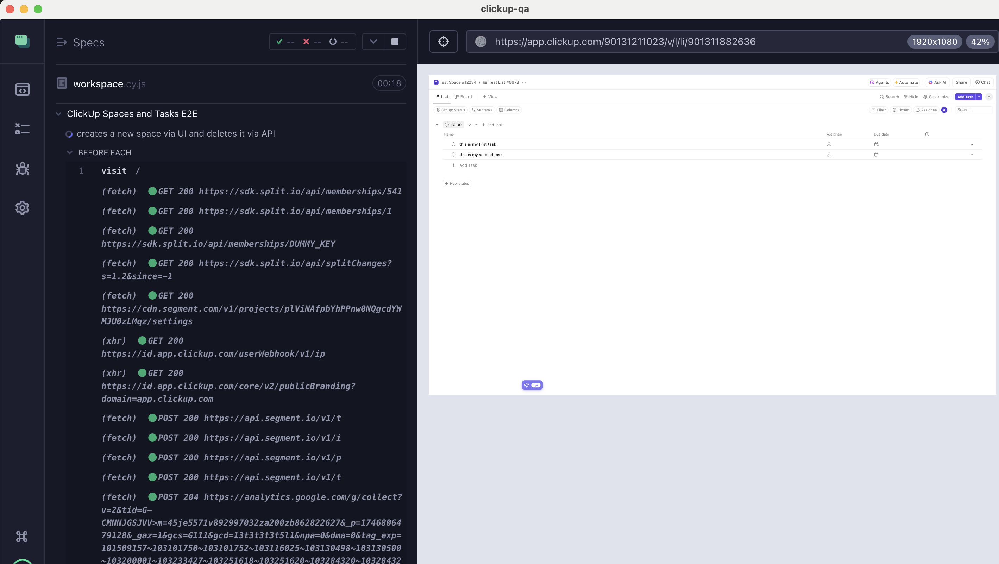
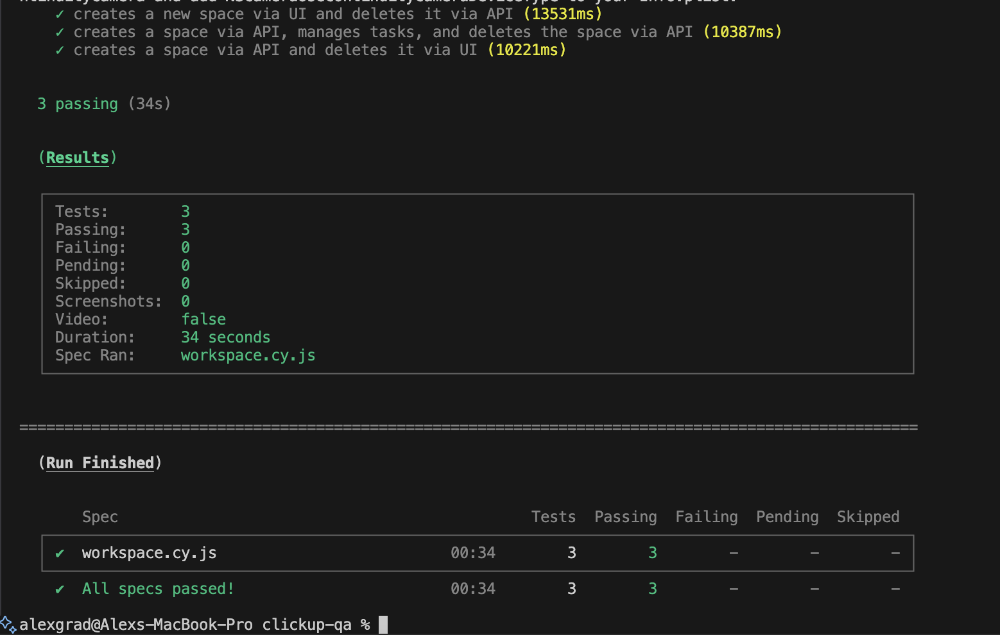
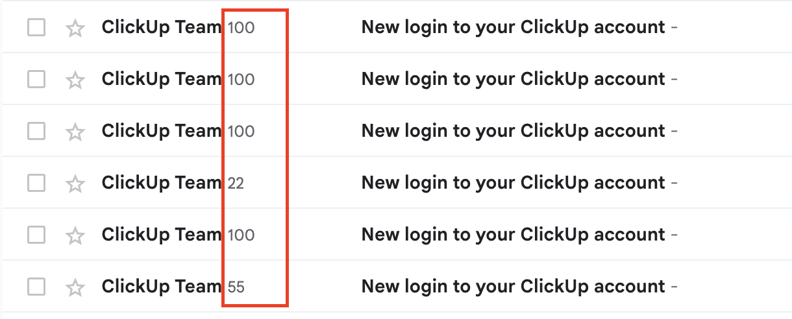

# ClickUp QA Automation Suite

[[Watch the video]](https://youtu.be/SQZJPT9bs6c)  

---
Screenshot of passed tests:


Screenshot of passed tests in headless mode

  
Screenshot of a successful login notification sent to email



## Overview
This project is an advanced Cypress-based end-to-end (E2E) automation suite for ClickUp’s web application. It demonstrates best practices in test automation, including the Page Object Model, API/UI hybrid testing, custom Cypress commands, and secure environment variable management.

---

## Features

### Page Object Model
- Modular, maintainable selectors and actions for spaces, lists, boards, posts, and login.

### Hybrid UI & API Testing
- Create and delete ClickUp spaces via both UI and API for robust, fast, and reliable tests.

### Custom Cypress Commands
- Includes advanced utilities like:
    - `apiCreateSpace`
    - `apiDeleteSpace`
    - (TODO) `clickWhileVisible` helper.

### Environment Variable Security
- All sensitive data (credentials, API keys, team IDs) are managed via `.env` and GitHub Actions secrets.

### CI/CD Ready
- GitHub Actions workflow for automated test runs (in progress).

### Professional Documentation
- Clear TODO and blocked test documentation for maintainability and transparency.

---

## Test Coverage

### Spaces
- Create via UI, delete via API.
- Create via API, manage tasks, delete via API.
- Create via API, delete via UI.

### Tasks
- Add, complete, and delete tasks in lists and boards.

### Posts
- **Blocked**: (Due to ClickUp plan limits) Planned: create and delete posts in chat.

### Login
- Secure login with environment variables.

---

## Security Note
> **Discovered Vulnerability**:  
> By clicking the login button twice, it is possible to bypass Google reCAPTCHA and automate login.  
> This is a significant vulnerability and should be addressed by the ClickUp security team.

---

## Getting Started

### 1. Clone the Repository
```bash
git clone https://github.com/your-username/clickup-qa.git
cd clickup-qa
```

### 2. Install Dependencies
```bash
npm ci
```

### 3. Set Up Environment Variables
Create a `.env` file in the project root:
```plaintext
CYPRESS_email=your@email.com
CYPRESS_password=yourpassword
CYPRESS_API=your_clickup_api_token
CYPRESS_teamId=your_team_id
```
It is highly recommended to use a newly created account or an account with no prior activity.

### 4. Run Tests Locally
```bash
npx cypress open
# or
npx cypress run
```

---

## CI/CD with GitHub Actions
The workflow is defined in `.github/workflows/main.yml`.

### Secrets
Set the following secrets in your repository’s GitHub Actions settings:
- `CYPRESS_EMAIL`
- `CYPRESS_PASSWORD`
- `CYPRESS_API`
- `CYPRESS_TEAMID`

### Workflow Steps
1. Install dependencies.
2. Inject secrets as environment variables.
3. Run Cypress tests.
4. Upload screenshots/videos on failure.

> **Note**: CI/CD is still in progress.

---

## Project Structure
```
clickup-qa/
├── cypress/
│   ├── fixtures/       # Test data
│   ├── integration/    # Test cases
│   ├── plugins/        # Custom plugins
│   ├── support/        # Page objects, custom commands
├── .github/
│   ├── workflows/      # CI/CD workflows
├── .env.example        # Example environment variables
├── package.json        # Project dependencies
└── README.md           # Documentation
```

---

## Why I Built This
This project demonstrates my ability to:
- Build robust, maintainable E2E test suites for modern web apps.
- Integrate API and UI testing for speed and reliability.
- Securely manage credentials and secrets in CI/CD.
- Document and communicate test coverage, limitations, and security findings.

I am excited to bring these skills to your team!
